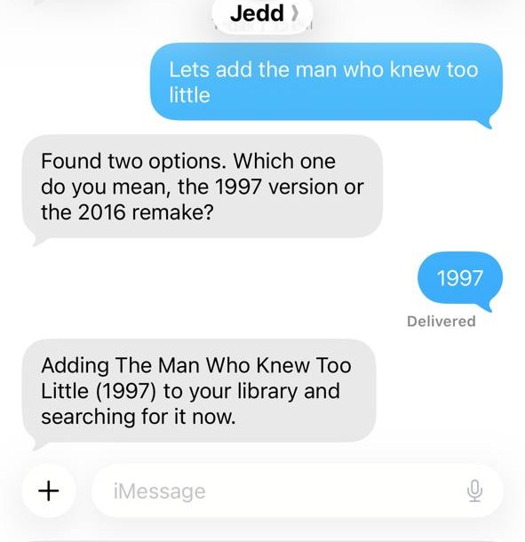

# Jedd

Jedd is a self-hosted iMessage bot that takes movie and TV requests in plain English and adds them
to your Sonarr/Radarr. Family and friends just text it ("can you get Dune Part Two?", "add Severance
season 1", "is it ready yet?") and it searches, adds, and follows up when the download is done — all
driven by a local LLM running on [Ollama](https://ollama.com), so requests never leave your network.

<p align="center">
  
</p>

It connects to three services you run yourself:

- **[BlueBubbles](https://bluebubbles.app)** — bridges iMessage (requires a Mac running Messages.app).
- **[Ollama](https://ollama.com)** — runs the LLM that understands requests (needs a tool-calling model).
- **[Sonarr](https://sonarr.tv) + [Radarr](https://radarr.video)** — your existing media library.

## Prerequisites

Jedd assumes you already run these — it does not bundle or set them up:

- **Sonarr + Radarr** — your existing instances ([sonarr.tv](https://sonarr.tv) / [radarr.video](https://radarr.video)).
- **Ollama** with a tool-calling model — install [ollama.com](https://ollama.com), then `ollama pull qwen2.5:7b`.
- **BlueBubbles server** on a Mac running Messages.app signed into an iMessage account — guide at [bluebubbles.app](https://bluebubbles.app).

## Quickstart

If your Sonarr/Radarr/Ollama run on standard ports you only need a handful of env vars. Pull the
published image and go:

```sh
docker run -d --name jedd \
  -p 18790:18790 \
  -e SONARR_API_KEY=... -e RADARR_API_KEY=... \
  -e SONARR_ROOT_FOLDER=/tv -e RADARR_ROOT_FOLDER=/movies \
  -e BLUEBUBBLES_URL=http://host.docker.internal:1234 -e BLUEBUBBLES_PASSWORD=... \
  -e BLUEBUBBLES_WEBHOOK_HOST=0.0.0.0 \
  -e BLUEBUBBLES_WEBHOOK_URL=http://<this-docker-host-LAN-IP>:18790/webhook \
  -e OWNER_PHONE=+15551234567 \
  -e OLLAMA_URL=http://host.docker.internal:11434 \
  -e SONARR_URL=http://host.docker.internal:8989/api/v3 \
  -e RADARR_URL=http://host.docker.internal:7878/api/v3 \
  -v jedd-data:/app/data \
  ghcr.io/jeffreylunt/jedd:latest
```

Or with Compose — copy [`.env.example`](.env.example) to `.env`, fill in the REQUIRED block, and:

```sh
docker compose up -d && docker compose logs -f
```

When it starts, Jedd registers a webhook with your BlueBubbles server and begins handling messages.
Text the iMessage account from your `OWNER_PHONE` to try it — working in a couple of minutes.

### Drop into an existing *arr stack

If your Sonarr/Radarr (and maybe Ollama) already run via Docker Compose, add Jedd to the **same
compose file / network** and reference the others by service name — no `host.docker.internal`, no
LAN IPs needed for them:

```yaml
  jedd:
    image: ghcr.io/jeffreylunt/jedd:latest
    restart: unless-stopped
    ports: ["18790:18790"]
    volumes: ["jedd-data:/app/data"]
    environment:
      SONARR_URL: http://sonarr:8989/api/v3      # add /sonarr base path for lscr.io images
      RADARR_URL: http://radarr:7878/api/v3
      OLLAMA_URL: http://ollama:11434
      SONARR_API_KEY: ...
      RADARR_API_KEY: ...
      SONARR_ROOT_FOLDER: /tv
      RADARR_ROOT_FOLDER: /movies
      BLUEBUBBLES_URL: http://<mac-running-bluebubbles>:1234
      BLUEBUBBLES_PASSWORD: ...
      BLUEBUBBLES_WEBHOOK_HOST: 0.0.0.0
      BLUEBUBBLES_WEBHOOK_URL: http://<docker-host-LAN-IP>:18790/webhook
      OWNER_PHONE: "+15551234567"
# volumes: { jedd-data: {} }
```

> **LinuxServer.io (lscr.io) images** often serve the API under a `/sonarr` or `/radarr` base path —
> if so, include it in the URL (e.g. `http://sonarr:8989/sonarr/api/v3`).

> **Inbound webhook:** the BlueBubbles server must be able to POST messages *back* to the container.
> Bind `0.0.0.0` (set above) and point `BLUEBUBBLES_WEBHOOK_URL` at an address the BlueBubbles host
> can reach this container at. See `.env.example` for details.

### Running from source (no Docker)

```sh
npm ci && npm run build
node dist/index.js   # reads .env from the working directory
```

## Configuration

All configuration is via environment variables (a `.env` file). Every option is documented in
[`.env.example`](.env.example). Summary:

| Variable | Required | Default | Description |
|---|---|---|---|
| `SONARR_URL` | | `http://localhost:8989/api/v3` | Sonarr API v3 base URL |
| `SONARR_API_KEY` | yes | — | Sonarr API key |
| `SONARR_ROOT_FOLDER` | yes | — | Root folder path as seen by Sonarr |
| `SONARR_QUALITY_PROFILE_ID` | | `1` | Quality profile id for added shows |
| `RADARR_URL` | | `http://localhost:7878/api/v3` | Radarr API v3 base URL |
| `RADARR_API_KEY` | yes | — | Radarr API key |
| `RADARR_ROOT_FOLDER` | yes | — | Root folder path as seen by Radarr |
| `RADARR_QUALITY_PROFILE_ID` | | `1` | Quality profile id for added movies |
| `OLLAMA_URL` | | `http://localhost:11434` | Ollama daemon URL |
| `OLLAMA_MODEL` | | `qwen2.5:7b` | Tool-calling model (alias: `LOCAL_MODEL`) |
| `BLUEBUBBLES_URL` | | `http://localhost:1234` | BlueBubbles server URL |
| `BLUEBUBBLES_PASSWORD` | yes | — | BlueBubbles server password |
| `BLUEBUBBLES_WEBHOOK_PORT` | | `18790` | Port the inbound webhook listens on |
| `BLUEBUBBLES_WEBHOOK_HOST` | | `127.0.0.1` | Bind host (use `0.0.0.0` in a container) |
| `BLUEBUBBLES_WEBHOOK_URL` | | derived | URL BlueBubbles POSTs inbound messages to |
| `OWNER_PHONE` | | — | Owner's number (full access, never spam-blocked) |
| `ALLOWED_SENDERS` | | (empty) | Comma-separated additional allowed numbers (see Access control) |
| `ALLOW_ALL_SENDERS` | | `false` | `true` opens the bot to anyone (see Access control) |
| `DISPLAY_NAME` | | `Jedd` | The bot's persona name |
| `PREFERRED_LANGUAGE` | | `English` | Documented release-language preference (see below) |

### Access control (default deny)

By default Jedd is **locked down**: only the `OWNER_PHONE` and any numbers in `ALLOWED_SENDERS` can
interact with it. Every other number is silently ignored — no processing, no reply. Out of the box
(empty `ALLOWED_SENDERS`, `ALLOW_ALL_SENDERS` unset) **only the owner can use the bot** until you add
numbers to the config.

- To let specific people in, add their numbers to `ALLOWED_SENDERS` (comma-separated, E.164 or US
  10-digit), e.g. `ALLOWED_SENDERS=+15557654321,+15559876543`.
- To open the bot to **anyone** who messages it, set `ALLOW_ALL_SENDERS=true`. (Spam is still
  rate-limited and pattern-blocked.)
- The owner is always allowed and is never spam-blocked.

### Sonarr/Radarr setup notes

- **Quality profile id** and **root folder** are specific to *your* instance. Find the profile id
  in the URL when editing a profile (Settings > Profiles), and the root folder under
  Settings > Media Management.
- **Language preference:** `PREFERRED_LANGUAGE` is documentation only — it does not enforce anything
  by itself. To actually prefer a language, add Custom Formats in your Sonarr/Radarr quality profiles
  (a positive "Language: <lang>" CF and a negative "Not <lang>" CF). Jedd reads the value but the
  scoring happens in your arr instance.

## How it works

1. The BlueBubbles server POSTs inbound iMessages to Jedd's webhook receiver.
2. Jedd runs a native tool-calling loop against your Ollama model. The model has tools to
   `search_movie` / `search_tv`, `add_movie` / `add_tv`, and `check_status`, all wired to the
   Sonarr/Radarr REST APIs.
3. When something is added, Jedd tracks it and a scheduler periodically checks the download state,
   proactively texting the requester when it's ready (or re-triggering a silently-failed search).
4. Replies go back out over the BlueBubbles REST API.

Several safety nets handle small-model quirks (promising an action without calling the tool,
claiming an add that didn't happen, over-disambiguating) so requests resolve reliably.

## macOS / iMessage caveat

iMessage requires Apple hardware. The **BlueBubbles server + Messages.app must run on a Mac** that
the container can reach. Jedd itself can run anywhere (Linux, a container, the same Mac), and Ollama
and Sonarr/Radarr can run on any reachable host.

## Scope (v1)

In scope: movies and TV, over iMessage (via BlueBubbles), using a local Ollama model. Out of scope:
ebooks, other messaging channels (Telegram/Discord/etc.), and non-Ollama LLM backends.

## License

[MIT](LICENSE).
